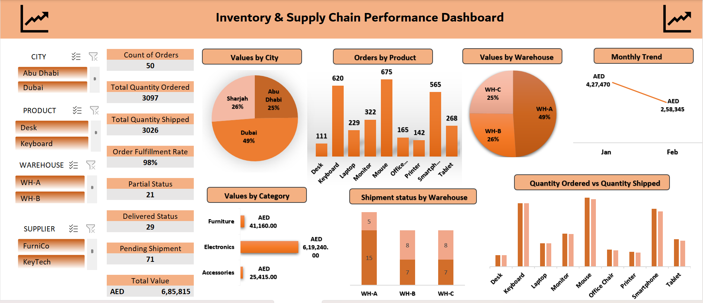

# 📊 Inventory & Supply Chain Performance Dashboard

## 📌 Project Overview

This project presents an Inventory and Supply Chain Performance Dashboard built in Microsoft Excel to analyze order fulfillment, shipment performance, and inventory value across cities, products, and warehouses.

## 🛠 Tools Used

• Microsoft Excel
• Pivot Tables
• Pivot Charts
• Excel Slicers
• Conditional Formatting
• Data Cleaning & Structuring

## 📈 Skills

• Data Analysis
• Supply Chain Data Interpretation
• Dashboard Design
• Data Visualization
• KPI Tracking
• Pivot Table Reporting
• Excel Data Modeling
• Business Insights Generation

## 🔍 Key Insights

• A total of 50 orders were processed, with 3097 units ordered and 3026 units shipped, resulting in an order fulfillment rate of ~98%.
• Dubai contributed the highest order value (49%), followed by Sharjah (26%) and Abu Dhabi (25%).
• Mouse and Keyboard are among the most frequently ordered products in the dataset.
• Warehouse A handled the highest shipment value (49%), indicating the largest operational load.
• The Electronics category generated the highest inventory value, and the monthly trend shows a decline from January to February.

This project helped me to create a dashboard to analyze inventory and supply chain data, track orders and shipments, and visualize key business insights for better decision-making.

## 📷 Dashboard Preview

